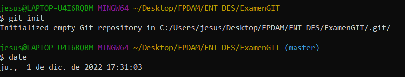
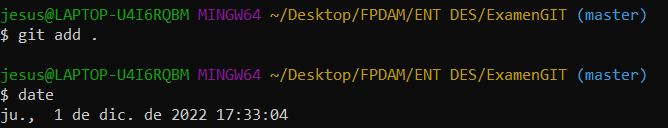
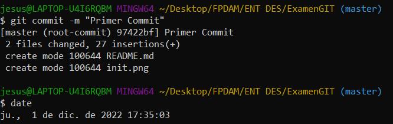
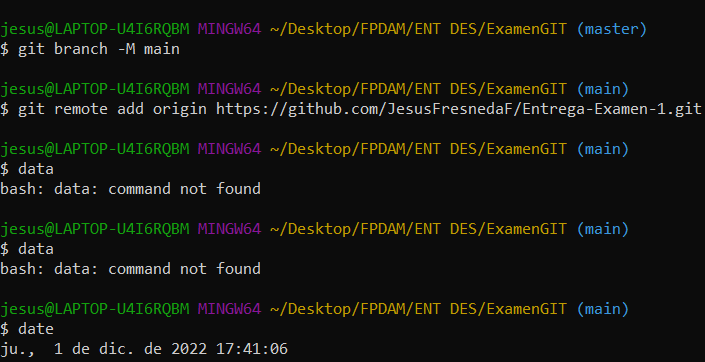
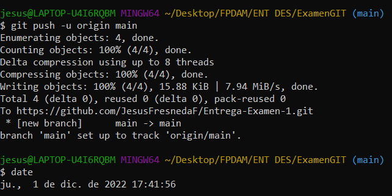

# Examen Entornos de desarrollos GIT

## Parte A: Repetir la tarea 1

El primer paso es inicializar el repositorio de la tarea con el comando:

~~~
git init
~~~

Después, pasamos el repositorio a la fase de "index" con el comando:

~~~
git add .
~~~

O

~~~
git add fichero.archivo
~~~

A continuación, para poner nuestro repositorio en la fase de "local repository" debemos ejecutar el comando commit:

~~~
git commit -m "commit"
~~~

En este momento, nuestro repositorio está en fase de "local repository".

Finalmente, para pasar de local repository a remote repository:

~~~
git branch -M main
git remote add origin "enlace repositorio github"
~~~

~~~
git push -u origin main
~~~

Y con éstos pasos conseguimos subir un repositorio a Github desde Git Bash.

## Parte B: Repetir la tarea 2

Para revisar los commits realizados, utilizaremos los siguientes comandos.

Primero, comprobemos los distintos commits que tenemos en este repositorio: 

~~~
git log --oneline --all
~~~

